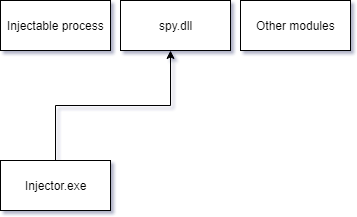

# Introduction

I don't advise to use code injection unless you are 100% aware of what you're doing, you're doing something positive and you already have a lot of experience with these kinds of topics. I think code injection is absolutely dangerous and nobody should actually use it; as to me it seems like taking control of someone's application. I'm studying this technique so that I can build a mod loader for Unity games, so others can add their content to a game. When making a mod loader, be aware of the EULA surrounding it, so you don't get sued.

The objective of this document is security and modding research; as such, it mentions ways of protecting and implementing the injection. However, not everything can be hacker-proof.

**NOTE: I am not responsible for anything caused
by readers of this document, please solely read this for a protection manual or
use it responsibly for good; not evil.** 

# DLL injection

## Definition

DLL Injection is where you inject your own code (packaged as a .dll file) into a different program, allowing you to access data and functions from the program you're injecting into.

## Use

DLL Injection is used in different ways for different applications; the most common way is just calling the other program to load your library and doing things in the DllMain. Some of the most infamous uses of this are; keyloggers and program hijackers, but there are also positive uses; such as program expansion, mod loaders, etc. The standard DLL injection method is easier to detect and also the most common approach, but it isn't the only way. Another method called "reflective DLL injection" allows you to load the library in your current program and send over the binary data, where after calling the function. This method is very hard to trace back and shouldn't be used often.

## Execution (Pseudo-code)

Executing this will require you to do several things:

 Obtain the pid (process id) of the target  
 Obtain the offset of the injection function  
 Open the process so you can write/read, query information and create threads  
 Allocate a C string in the process with the DLL path  
 Get the remote address of 'LoadLibraryA', so the function can be executed  
 Run a remote thread with that function  
 Wait for it to finish  
 Query the injected DLL's base address  
 Add the function offset to the base address to get the remote function  
 Run a remote thread with that function  
 Wait for it to finish  
 Close handles and free memory  



As shown above, you allocate spy.dll into the injectable process and then you call the
spy's function.

## Execution (C++ code)

### Injector.exe

```cpp
HMODULE loc = LoadLibraryA(dllPath.c_str());
printf("Checking for library at path %s\n", dllPath.c_str());
check(loc, "Can't load dll");

FARPROC dllFunc = GetProcAddress(loc, "initialize");
check(dllFunc, "Can't load dll function");

size_t dllFuncOff = (size_t)dllFunc - (size_t)loc;
printf("%s::initialize found at %p\n", dllPath.c_str(), (void*) dllFuncOff);
```

LoadLibrary on Windows (The A stands for ASCII, while W would stand for wide) returns the base address of the library that you pass in; if the library isn't loaded yet, it will load it for you. 

We then get the function of the initialize DLL function, which is also an address (since all functions are actually addresses). We can subtract this from the DLL's base address and get the offset of the function in the DLL.

```cpp
//Get process
HANDLE process = OpenProcess(
	PROCESS_QUERY_INFORMATION | PROCESS_CREATE_THREAD | 
	PROCESS_VM_OPERATION | PROCESS_VM_WRITE | PROCESS_VM_READ,
	FALSE, processId
);

check(process, "Couldn't open process");
```

Here we open the process so that we can get information, create remote threads and
read/write into its memory.

```cpp
LPVOID allocString(HANDLE process, std::string str) {

	DWORD size = (DWORD) str.size() + 1;
	LPVOID remote = VirtualAllocEx(process, NULL, size, MEM_COMMIT | MEM_RESERVE, PAGE_READWRITE);
	check(remote, "Couldn't allocate space into process");
	check(WriteProcessMemory(process, remote, (PVOID) str.c_str(), size, NULL), "Couldn't write string into memory");

	return remote;
}
```

This function will allow you to copy a string into the host by allocating the size of the string (+ 1 end string character '\0') and then writing the data to that memory. We could use this function every time we want to message something to our spy program and supply this pointer to it.

```cpp
//Copy the string into the other process
LPVOID dllStr = allocString(process, dllPath);

//Load the dll into memory
HMODULE kernel32 = GetModuleHandle(TEXT("kernel32"));
PTHREAD_START_ROUTINE loadLibraryProc = (PTHREAD_START_ROUTINE) GetProcAddress(kernel32, "LoadLibraryA");
check(loadLibraryProc, "Couldn't get 'load library'");
```

We allocate the string into the host and then we get the address of LoadLibraryA, which will stay the same in all processes, since kernel32.dll is always loaded first. 

```cpp
//Run the load library function
HANDLE thread = CreateRemoteThread(process, NULL, 0, loadLibraryProc, dllStr, 0, NULL);
check(thread, "Couldn't start library on remote process");

//Wait for it to finish and stop
WaitForSingleObject(thread, INFINITE);
```

Create remote thread will run the function but it only supports 1 argument; PVOID (a void pointer). Luckily, LoadLibraryA takes in a C string as it's first argument, which is the same thing low level (just an address). We pass 'dllStr' as the library it should load and we wait for that to finish.

```cpp
//Check if it was successfully injected

HMODULE handles[2048];
DWORD needed = 0;
EnumProcessModules(process, handles, sizeof(handles), &needed);
```

We then allocate 2048 handles in our injector, just so we can query a large number of modules from the host. These HMODULEs are the loaded dlls and the exe of the injected process, which we can run through to see if our host was successfully injected and obtain the base address (which is literally just the HMODULE itself). 

```cpp
char name[1024];

for (int i = 0; i < needed / sizeof(handles[0]); ++i) {
```

We allocate 1024 bytes for the name and we loop through all handles.

```cpp
	GetModuleBaseName(process, handles[i], name, sizeof(name));

	if (std::string(name) == dllName) {
```

Then we get the module name and compare it by our dllName. If it matches, we know the
address and the module of our spy module.

```cpp
		PTHREAD_START_ROUTINE remoteInitialize = (PTHREAD_START_ROUTINE)(((char*) handles[i]) + dllFuncOff);

		HANDLE dllThread = CreateRemoteThread(process, NULL, 0, remoteInitialize, NULL, 0, NULL);
		check(dllThread, "Couldn't run initialize on remote thread");
```

Now we know the remote function's address, which means that we can execute it. Just like before, we need to wait for it and close it when we're done.

```cpp
		WaitForSingleObject(dllThread, INFINITE);
		CloseHandle(dllThread);
	}
}
```

Everything that we allocated before has to be freed and closed; which we do with the following calls:

```cpp
VirtualFreeEx(process, dllStr, 0, MEM_RELEASE);
CloseHandle(thread);
CloseHandle(process);
```

### Spy.dll

The last thing we need is 'spy.dll', the spy that will infiltrate the program and give us access to everything. This will be the one that executes the functions on the other process.

```cpp
//This dll is innocent, no suspicious calls in DllMain
BOOL WINAPI DllMain(HINSTANCE, DWORD fdwReason, LPVOID)  {
	return TRUE;
}
```

Our DllMain is very innocent, making our DLL seem harmless; it doesn't do anything, but we hide our true intention into the function we call with create remote thread. We do this because Windows disables DLL loading and other things in DllMain and we might want to do that.

```cpp
extern "C" __declspec(dllexport) DWORD initialize(LPVOID param) {
```

This function will be found and loaded with our injector. If we wanted to, we could pass something back to our injector and/or accept something from there. 

## Prevention

Preventing DLL injection fully isn't possible, but you can make it harder for others to inject into your program. One thing is to hook into LoadLibrary and check if the name of the DLL is on your whitelist, if it's not, you throw ERROR_ACCESS_DENIED and it won't be loaded. This can also be used for SetWindowsHookEx (another method of hooking into a program), however, when this hook is not in place, they can sneak past, which means that if the process is started by the injector it can immediately be injected; avoiding all lines of security. The thread can be suspended and hooks can be placed before other code is ran, but this is only possible if the process is not fully initialized yet.

# Mono injection

## Definition

Mono injection is where you inject into a program using mono; such as Unity. Mono is a program that bridges C# to C++ and allows you to run functions, get classes, packages, DLLs and add DLLs to the current program. This is very useful when you yourself want to use mono to load in code (like how Unity handles most code in C# high level, to avoid overcomplication for gameplay programmers and for language features), but it can be very dangerous when something is injecting into your program. We can get mono functions from our spy program and run those to load our own DLLs onto the main thread and run functions from it. This means that we can inject any C# code, allowing us to use C# reflection. This results into us being able to mod any Unity game.

## Use

Mono injection is mostly used when you want to get C# code into a program using C++. A use of this could be to get access to reflection, because the main application is written in C#. An example of this is a modding API for Unity.

## Execution (Pseudo-code)

get mono.dll
 load all required mono functions
 attach to mono thread
 load DLL into mono
 get class from DLL
 get function from class
 invoke function

## Execution (C++)

Since I store my spy program into 1 source file, I can make a very simple way of loading functions from mono.

```c++
std::vector<std::pair<bool(*)(), const char*>> funcsToInit;

bool addFuncToInit(bool (*f)(), const char *str) {
	funcsToInit.push_back(std::pair<bool(*)(), const char*>(f, str));
	return true;
}

HMODULE mono;

#define MONO_FUNC_T(x, params, y)\
x (*y)(params) = nullptr;\
bool y##_func(){ y = (x (*)(params)) GetProcAddress(mono, #y); return y != nullptr; }\
const bool y##_funcInitb = addFuncToInit(y##_func, #y);

#define MONO_FUNC(params, y) MONO_FUNC_T(PVOID, params, y);

#define _(...) __VA_ARGS__
```

Per mono function definition, we'll store an initialization function into 'funcsToInit' as well as define the function pointer as null. Then, we'll use a variable to call 'addFuncToInit' so it's actually stored in the vector. This is because we need to load mono first, before we can create functions from it.

```C++
MONO_FUNC(_(), mono_domain_get);
MONO_FUNC(_(PVOID), mono_thread_attach);
MONO_FUNC(_(), mono_get_root_domain);
MONO_FUNC(_(PVOID, PCHAR), mono_domain_assembly_open);
MONO_FUNC(_(PVOID, PCHAR, PCHAR), mono_class_from_name);
MONO_FUNC(_(PVOID, PCHAR, DWORD), mono_class_get_method_from_name);
MONO_FUNC(_(PVOID, PVOID, PVOID*, PVOID), mono_runtime_invoke);
MONO_FUNC(_(PVOID), mono_assembly_get_image);
```

This would be equivalent to defining those functions by hand; `PVOID (*mono_domain_get)(), PVOID (*mono_thread_attach)(PVOID), etc.` And setting them to null, where after you have to manually get every single function from the DLL. The _() hack is used to allow you to pass multiple arguments as one argument; if you don't use that, it will see everything separated by a comma as an argument.

```c++
#define ERROR_CHECK(var, errorMessage, ...)\
if ((var) == NULL) {\
	printf(errorMessage "\n", __VA_ARGS__);\
	goto failed;\
}
```

```c++
ERROR_CHECK(mono = LoadLibraryA("mono.dll"), "Couldn't initialize mono");
	
for(auto f : funcsToInit)
ERROR_CHECK((void*)f.first(), "Couldn't initialize mono function (%s)", f.second);
```

That's all we need to init all functions. This means it is really easy to initialize all functions and it is very expandable (we can easily add more functions if needed).

```c++
#ifdef __DEBUG_MODE__
	AllocConsole();
	SetConsoleTitleA("Harpoon debug console");

	FILE* fp;
	freopen_s(&fp, "CONOUT$", "w", stdout);
	printf("Loading HarpoonCore\n");
#endif
```

If you need it, you can allocate a console; so, your spy program can log what it found (but revealing itself). If you don't do this, you can't use printf or cout. Don't forget to get rid of this console when the program finishes though.

```C++
PVOID rootDomain = mono_get_root_domain();
ERROR_CHECK(rootDomain, "Couldn't initialize mono root domain");

mono_thread_attach(rootDomain);

PVOID monoDomain = mono_domain_get();
ERROR_CHECK(monoDomain, "Couldn't initialize mono domain");

PVOID domainAssembly = mono_domain_assembly_open(monoDomain, __dll__ ".dll");
ERROR_CHECK(domainAssembly, "Couldn't initialize mono domain assembly");

PVOID image = mono_assembly_get_image(domainAssembly);
ERROR_CHECK(image, "Couldn't initialize mono image");

PVOID monoClass = mono_class_from_name(image, __namespace__, __class__);
ERROR_CHECK(monoClass, "Couldn't initialize mono class (%s.%s)", 
            __namespace__, __class__);

PVOID monoMethod = mono_class_get_method_from_name(monoClass, __function__, 0);
ERROR_CHECK(monoMethod, "Couldn't initialize mono method (%s.%s.%s)", 
            __namespace__, __class__, __function__);

mono_runtime_invoke(monoMethod, NULL, NULL, NULL);

goto succeeded;
```

First you get the 'root domain' which is the main thread and then you attach to that thread; so that any assembly loaded next will have access to the main thread. After loading the DLL, you get the image (the reflection data) and then you can get the class and a function from that class. After that, you can simply invoke that function.

## Prevention

There isn't really a good prevention against mono injection; however, removing mono will definitely solve it. If you really need mono, you could hook into their most important functions (like loading DLLs) and check if the DLL should really be loaded (like DLL injection prevention).

# Reflective DLL injection

## Definition

Works almost the same as DLL Injection, the only difference is that it doesn't use the kernel's LoadLibrary function (in the remote process), but directly places the DLL into the process's memory. This provides a way around hooks into the LoadLibrary function, since the target's hook won't be placed inside our program. 

## Use

In games, RDI can be used to circumvent cheating engines that might check the LoadLibrary function to prevent loading libraries when in a session or after all base libraries have been loaded. There's software that would try anything to keep people out of their process, but with RDI it's a lot harder.

## Execution (pseudo-code)

RDI is very similar to DI, except it doesn't call LoadLibrary and so it looks like the following:

 obtain the pid (process id) of the target  
 obtain the offset of the injection function  
 obtain the size of the injection DLL  
 open the process so you can write/read, query information and create threads  
 allocate a buffer (size of injection DLL) in the process with the DLL path  
 copy the injection DLL into the allocated buffer  
 calculate the new address in memory  
 dynamically link the pointers (strings & functions) using a manual heap  
 run a remote thread with that function  
 wait for it to finish  
 close handles and free memory  

## Execution (C++ code)

```cpp
//Get our dll's module info
MODULEINFO info;
check(GetModuleInformation(GetCurrentProcess(), loc, &info, (DWORD) sizeof(info)), "Couldn't get module info");
```

In the code above, we obtain the DLL's length (which is stored in MODULEINFO's SizeOfImage variable) so we know the start and the end of the module buffer. Even though the MODULEINFO struct contains the start offset, we already know it; the HMODULE itself is the address of the module.

```cpp
LPVOID allocBuffer(HANDLE process, void *start, DWORD length, bool exec) {

	LPVOID remote = VirtualAllocEx(process, NULL, length, MEM_COMMIT | MEM_RESERVE, exec ? PAGE_EXECUTE_READWRITE : PAGE_READWRITE);
	check(remote, "Couldn't allocate space into process");
	check(WriteProcessMemory(process, remote, (LPVOID)start, length, NULL), "Couldn't write buffer into memory");

	return remote;
}
```

This function is almost the same as allocString, except it doesn't increase the size by 1. We can use this function to send our 'buffer' to the target. We also allow the code in the buffer to be executed.

```cpp
//Copy the module into another process
LPVOID rdl = allocBuffer(process, loc, info.SizeOfImage, true);
```

We copy our module into the process's memory and this means that we can calculate the location of our function.

```cpp
//Run our remote function
PTHREAD_START_ROUTINE initialize = (PTHREAD_START_ROUTINE)((char*)rdl + dllFuncOff);

HANDLE thread = CreateRemoteThread(process, NULL, 0, initialize, NULL, 0, NULL);
check(thread, "Couldn't start library on remote process");
```

Our location of our spy's initialize function stays the same, so we can add the offset from the base to the allocated remote module. We can then run this with a remote thread.

```cpp
//Wait for it to finish and stop
WaitForSingleObject(thread, INFINITE);

VirtualFreeEx(process, rdl, 0, MEM_RELEASE);
CloseHandle(thread);
CloseHandle(process);
```

We need to wait for the process and clean up our spy when it is done.

## Problem

With our code above, we have the following problem; loading a library isn't as simple as inputting the code into the program. The library we made has dependencies it has to link and those dependencies aren't loaded in the target program or they might have a different address. This means that EVERY SINGLE call to a function is now wrongly linked; this can be fixed by getting the relative offset of the function and adding it to the actual function's address.

Things that require addresses include (but are not limited to): strings, buffers and (virtual) functions. This is why I'd suggest allocating all points onto a heap from the injector and sending it to the spy.  

**Keep in mind that a lot of things are happening low-level. Keep your spy.dll in C code and turn off things like buffer overflow protection. Using C++ or advanced methods of code generation use all kinds of function calls / memory calls behind the scenes; this is the opposite of what you want!**

## Rewriting spy.dll

To fix this, we need spy.dll to be so portable that it doesn't need any external function calls that might have to be linked, which requires us to rewrite spy.dll. Currently, we are using C++ for spy, but C++ does a lot of calls under the hood and that's the thing we don't want. This means that we have to switch to C and get rid of non-function variables and function calls. Afterwards, we can inspect the generated assembly files by turning it on in project/C++/output in Visual Studio.

```c
#ifdef _WIN64
#define padptr 8
#else
#define padptr 4
#endif

#define sHarpoon_Core strings + 0
#define sHarpoonCore strings + 13
#define sInitialize strings + 25
#define sHarpoon_Core_dll strings + 36
#define fmono_domain_get strings + 53
#define fmono_thread_attach strings + 53 + padptr
#define fmono_get_root_domain strings + 53 + padptr * 2
#define fmono_domain_assembly_open strings + 53 + padptr * 3
#define fmono_class_from_name strings + 53 + padptr * 4
#define fmono_class_get_method_from_name strings + 53 + padptr * 5
#define fmono_runtime_invoke strings + 53 + padptr * 6
#define fmono_assembly_get_image strings + 53 + padptr * 7

//Minimal mono injector
__declspec(dllexport) unsigned int initialize(char *strings) {

	//Attach to root domain

	void* (*mono_thread_attach)(void*) = *(void**)(fmono_thread_attach);
	void* (*mono_get_root_domain)() = *(void**)(fmono_get_root_domain);

	mono_thread_attach(mono_get_root_domain());

	//Get domain

	void* (*mono_domain_get)() = *(void**)(fmono_domain_get);
	void* (*mono_domain_assembly_open)(void*, char*) = 
        *(void**)(fmono_domain_assembly_open);

	void* domainAssembly = mono_domain_assembly_open(mono_domain_get(), sHarpoon_Core_dll);

	//Get function in class

	void* (*mono_class_from_name)(void*, char*, char*) = 
        *(void**)(fmono_class_from_name);
	void* (*mono_class_get_method_from_name)(void*, char*, unsigned int) = 
        *(void**)(fmono_class_get_method_from_name);
	void* (*mono_assembly_get_image)(void*) = 
        *(void**)(fmono_assembly_get_image);

	void *image = mono_assembly_get_image(domainAssembly);
	void *monoClass = mono_class_from_name(image, sHarpoon_Core, sHarpoonCore);
	void *monoMethod = mono_class_get_method_from_name(monoClass, sInitialize, 0);

	//Invoke function

	void* (*mono_runtime_invoke)(void*, void*, void**, void*) = *(void**)(fmono_runtime_invoke);

	mono_runtime_invoke(monoMethod, 0, 0, 0);

	return 1;

}
```

The above spy.dll is a very simple version of mono injection (without any checks), this is to reduce the size of the generated code, so it's easier to debug.

Now, the problem before is that we use strings (and function pointers). Strings are actually char pointers and that data has to be stored somewhere. This means that the pointers to the strings are invalid if our program is moved, which is not what we want. Just like any other pointer (that's not local), we have to avoid them. We can do this by allocating the data from our injector and sending all functions to it.

This gives us the following struct code:

```cpp
char data[] = {
	"Harpoon.Core\0"			//0
	"HarpoonCore\0"				//13
	"Initialize\0"				//25
	"Harpoon.Core.dll\0"		//36
	padptr						//53;	fmono_domain_get
	padptr						//		fmono_thread_attach
	padptr						//		fmono_get_root_domain
	padptr						//		fmono_domain_assembly_open
	padptr						//		fmono_class_from_name
	padptr						//		fmono_class_get_method_from_name
	padptr						//		fmono_runtime_invoke
	padptr						//		fmono_assembly_get_image
};
```

padptr in this context (injector.exe) is just 4 or 8 empty bytes (depending on your architecture), that will be used to store the function pointers.

## Send data from Injector.exe

Injector.exe will have to be revised to work for allocating this data and setting those functions. I do it like following:

```cpp
//... Setup process
//Setup remote and copy dll (so copy dll can be dynamically linked)

CopyDll harpoon = loadCopyDll(dllPath.c_str(), process);
RemoteDll mono = getRemoteDll(process, "mono.dll");

//Setup a command to get our functions from DLL
std::vector<std::string> funcs = {
	"mono_domain_get",
	"mono_thread_attach",
	"mono_get_root_domain",
	"mono_domain_assembly_open",
	"mono_class_from_name",
	"mono_class_get_method_from_name",
	"mono_runtime_invoke",
	"mono_assembly_get_image"
};

auto functionMap = getFunctions(mono, funcs);

//These are our strings (and functions); but we can't use those directly
//This is because this program will be moved and any pointer will be invalid
char data[] = {
	"Harpoon.Core\0"				//0
	"HarpoonCore\0"					//13
	"Initialize\0"					//25
	"Harpoon.Core.dll\0"			//36
	padptr							//53;	fmono_domain_get
	padptr							//		fmono_thread_attach
	padptr							//		fmono_get_root_domain
	padptr							//		fmono_domain_assembly_open
	padptr							//		fmono_class_from_name
	padptr							//		fmono_class_get_method_from_name
	padptr							//		fmono_runtime_invoke
	padptr							//		fmono_assembly_get_image
};

constexpr size_t pad = sizeof(void*);

*(void**)(data + 53) = functionMap["mono_domain_get"];
*(void**)(data + 53 + pad) = functionMap["mono_thread_attach"];
*(void**)(data + 53 + pad * 2) = functionMap["mono_get_root_domain"];
*(void**)(data + 53 + pad * 3) = functionMap["mono_domain_assembly_open"];
*(void**)(data + 53 + pad * 4) = functionMap["mono_class_from_name"];
*(void**)(data + 53 + pad * 5) = functionMap["mono_class_get_method_from_name"];
*(void**)(data + 53 + pad * 6) = functionMap["mono_runtime_invoke"];
*(void**)(data + 53 + pad * 7) = functionMap["mono_assembly_get_image"];;

LPVOID dat = allocBuffer(process, data, (DWORD) sizeof(data), false);

//Run our remote function
PTHREAD_START_ROUTINE initialize = (PTHREAD_START_ROUTINE) getRemoteFunc(harpoon, "initialize");
printf("Running %s::initialize at %p\n", dllPath.c_str(), (void*)initialize);

HANDLE thread = CreateRemoteThread(process, NULL, 0, initialize, dat, 0, NULL);
check(thread, "Couldn't start library on remote process");

//Wait for it to finish and free everything
WaitForSingleObject(thread, INFINITE);

VirtualFreeEx(process, dat, 0, MEM_RELEASE);
VirtualFreeEx(process, harpoon.remote, 0, MEM_RELEASE);
CloseHandle(thread);
FreeLibrary(harpoon.current);

//Handle process cleanup
```

In the code above, you can see we query the DLL functions, this can only be done if the DLL has the same architecture as the current system (so x64 won't work with x86 and vice versa). In 'getFunctions', the remote DLL gets loaded into this program (with LoadLibraryExA DONT_RESOLVE_DLL_REFERENCES). And GetProcAddress is used to query the offsets of all functions.

## Prevention

The only prevention against RDI and DI is that they have to go through OpenProcess, which specifies the security that it requires. For these methods we need query information, create thread, vm operation, vm read and vm write. We can only access processes that are on our current level, so elevated ones can't be injected into. The other protection is that virus scanners and other software might detect if we use OpenProcess and/or RemoteThread, which can be prevented by using Nt calls (which Windows wraps, so marking that as virus would classify Windows as one). But as a program, there's not a lot you can do.

## Benefits

Benefits from RDI include: no hogging of the DLL file and anonymity. However, the costs you have to go to will make regular DI a lot more worth it, if you don't care about those two benefits. This is because loading a DLL using LoadLibrary will link it, but linking is the opposite of what we want, since we're going to change our address space. Requiring us to go further than ever to prevent pointers to non-local address objects.
